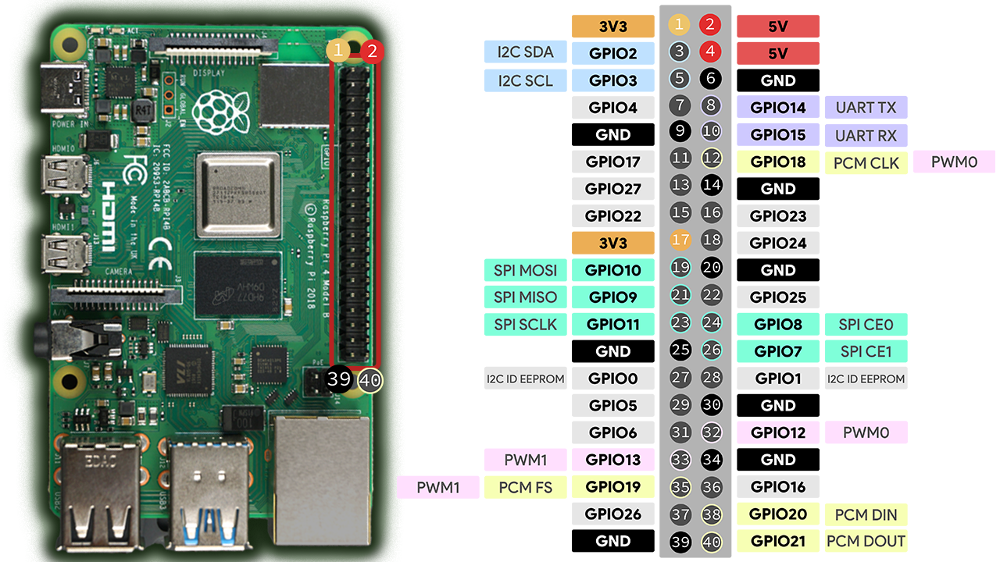

# Serial

The serial hardware interface is `/dev/serial0`. I am of the understanding that it maps to `/dev/AMA0`, although can only write to `/dev/serial0`.

This is different from serial interface for the Kria.
# Serial and pins

UART configuration and wiring for Raspberry Pi 4B with Cube Orange and RFD 900x-US.

## Serial devices

- Primary serial alias: `/dev/serial0`
- UART devices: `/dev/ttyAMA0` (UART0) and `/dev/ttyAMA1` (UART2)

Note: Names can differ based on overlays and Bluetooth configuration. We standardize on UART0 for Cube Orange and UART2 for RFD 900x.

## Enable UARTs

You can enable UARTs using raspi-config

1. Raspi-config (installable via script):
- Install helper: `Tools/Setup-Scripts/install-raspi-config`
- Run `sudo raspi-config` → Interface Options → Serial Port
	- Disable login shell over serial
	- Enable serial interface

2. Edit `/boot/firmware/config.txt` directly:

```bash
sudo su
cd /boot/firmware
nano config.txt
```

Add or confirm:

```
# Enable the serial pins
enable_uart=1
dtoverlay=uart2
dtoverlay=disable-bt
```

Reboot and verify:

```bash
ls -l /dev/serial*
```

You should see two devices. Typical mapping we use:

| UART Interface | TXD Pin | RXD Pin | CTS Pin | RTS Pin | Device       | Use            |
|----------------|---------|---------|---------|---------|--------------|----------------|
| UART0          | GPIO14  | GPIO15  | GPIO16  | GPIO17  | /dev/ttyAMA0 | Cube Orange    |
| UART2          | GPIO0   | GPIO1   | —       | —       | /dev/ttyAMA1 | RFD 900x Radio |

## Raspberry Pi 4B pinout



BCM refers to Broadcom GPIO numbering. Unless noted, we reference the physical pin numbers where helpful.

## RFD 900x-US pinout


| Pin # | Name         | Direction | Description           | Max Voltage |
|-------|--------------|-----------|-----------------------|-------------|
| 1     | GND          | —         | Ground                | 0V          |
| 2     | GND          | —         | Ground                | 0V          |
| 3     | CTS          | Input     | Clear to send         | 3.3V        |
| 4     | Vcc          | —         | Power supply          | 5V          |
| 5     | Vusb         | —         | USB power input       | 5V          |
| 6     | Vusb         | —         | USB power input       | 5V          |
| 7     | RX           | Input     | UART Data In          | 3.3V        |
| 8     | GPIO5/P3.4   | I/O       | Digital I/O           | 3.3V        |
| 9     | TX           | Output    | UART Data Out         | 3.3V        |
| 10    | GPIO4/P3.3   | I/O       | Digital I/O           | 3.3V        |
| 11    | RTS          | Output    | Request to send       | 3.3V        |
| 12    | GPIO3/P1.3   | I/O       | Digital I/O           | 3.3V        |
| 13    | GPIO0/P1.0   | I/O       | Digital I/O           | 3.3V        |
| 14    | GPIO2/P1.2   | I/O       | Digital I/O           | 3.3V        |
| 15    | GPIO1/P1.1   | I/O       | Digital I/O, PPM I/O  | 3.3V        |
| 16    | GND          | —         | Ground                | 0V          |

## Connections

### Raspberry Pi ↔ RFD 900x-US

| Raspberry Pi Pin       | RFD Pin |
|------------------------|---------|
| Pin 4 (5V)             | 4 (5V)  |
| Pin 6 (GND)            | 1 (GND) |
| Pin 27 (GPIO0 / TX)    | 7 (RX)  |
| Pin 28 (GPIO1 / RX)    | 9 (TX)  |

### Raspberry Pi ↔ Cube Orange (TELEM)

| Cube TELEM Pin | Signal Name        | Raspberry Pi GPIO | RPi Physical Pin |
|:--------------:|:-------------------|:------------------|:-----------------|
| 1              | 5V (VCC)           | 5V Power          | Pin 2            |
| 2              | TX (from Cube)     | RXD (GPIO15)      | Pin 10           |
| 3              | RX (to Cube)       | TXD (GPIO14)      | Pin 8            |
| 4              | CTS (from Cube)    | RTS (GPIO17)      | Pin 11           |
| 5              | RTS (to Cube)      | CTS (GPIO16)      | Pin 36           |
| 6              | GND                | Ground            | Pin 14           |

Notes
- All UART logic levels are 3.3V TTL on the Pi. Do not feed 5V logic into Pi GPIOs.
- After wiring, verify ports appear as expected with `ls -l /dev/serial*`.


