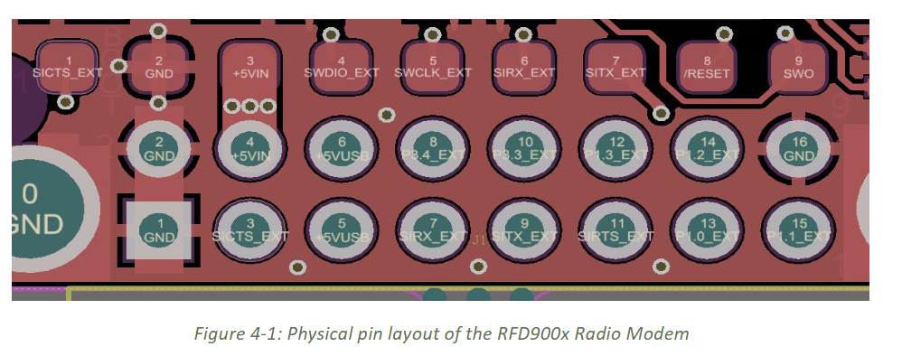

# Serial

The serial hardware interface is `/dev/serial0`. I am of the understanding that it maps to `/dev/AMA0`, although can only write to `/dev/serial0`.

This is different from serial interface for the Kria.

## How to enable serial

You may have to manually enable serial by editing the firmware. You can do this manually by editing the `config.txt` and `cmdline.txt` files in `/boot/firmware/`, or run the [install script for raspi-config](../../Tools/Setup-Scripts/install-raspi-config), and use that interface to do so.

# Pins

## Raspberry Pi

This is the pinout for the raspberry Pi4b. BCM stands for Broadcom, and refers to the microcontroller used for the pi. You may see Raspi pins referred to either in BCM or regular notation. This document will use regular notation unless (BCM) is specified.

## RFD 900x US

| Pin # | Name         | Direction | Description         | Max Voltage |
|-------|--------------|-----------|---------------------|-------------|
| 1     | GND          | -         | Ground              | 0V          |
| 2     | GND          | -         | Ground              | 0V          |
| 3     | CTS          | Input     | Clear to send       | 3.3V        |
| 4     | Vcc          | -         | Power supply        | 5V          |
| 5     | Vusb         | -         | Power supply from USB | 5V        |
| 6     | Vusb         | -         | Power supply from USB | 5V        |
| 7     | RX           | Input     | UART Data In        | 3.3V        |
| 8     | GPIO5/P3.4   | I/O       | Digital I/O         | 3.3V        |
| 9     | TX           | Output    | UART Data Out       | 3.3V        |
| 10    | GPIO4/P3.3   | I/O       | Digital I/O         | 3.3V        |
| 11    | RTS          | Output    | Request to send     | 3.3V        |
| 12    | GPIO3/P1.3   | I/O       | Digital I/O         | 3.3V        |
| 13    | GPIO0/P1.0   | I/O       | Digital I/O         | 3.3V        |
| 14    | GPIO2/P1.2   | I/O       | Digital I/O         | 3.3V        |
| 15    | GPIO1/P1.1   | I/O       | Digital I/O, PPM I/O | 3.3V       |
| 16    | GND          | -         | Ground              | 0V          |

# Connection between Raspi and RFD 900x US

| Raspberry Pi Pin   | RFD Pin   |
|--------------------|-----------|
| 4 (5V)            | 4 (5V)    |
| 6 (GND)           | 1 (GND)   |
| 8 (BCM 14) (TX)   | 7 (RX)    |
| 10 (BCM 15) (RX)  | 9 (TX)    |

